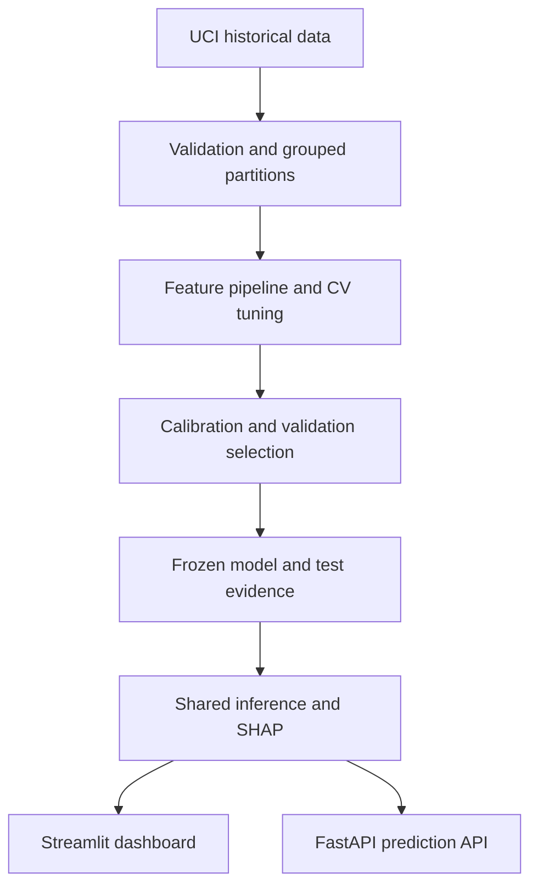
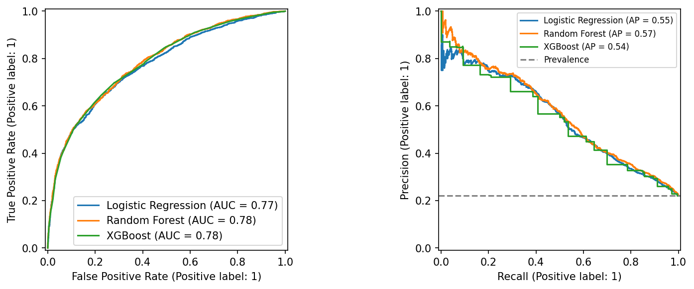
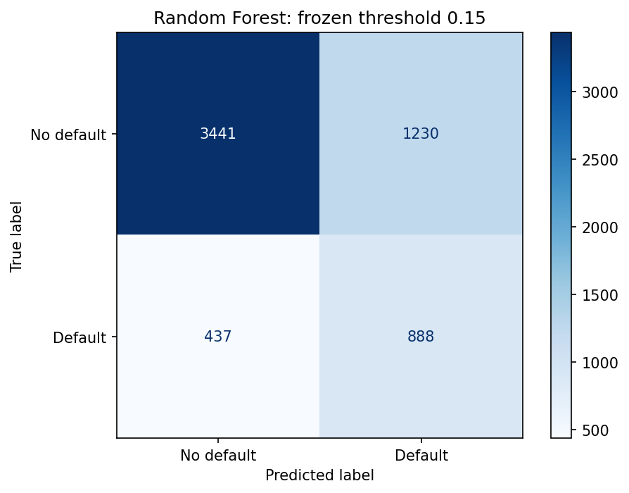
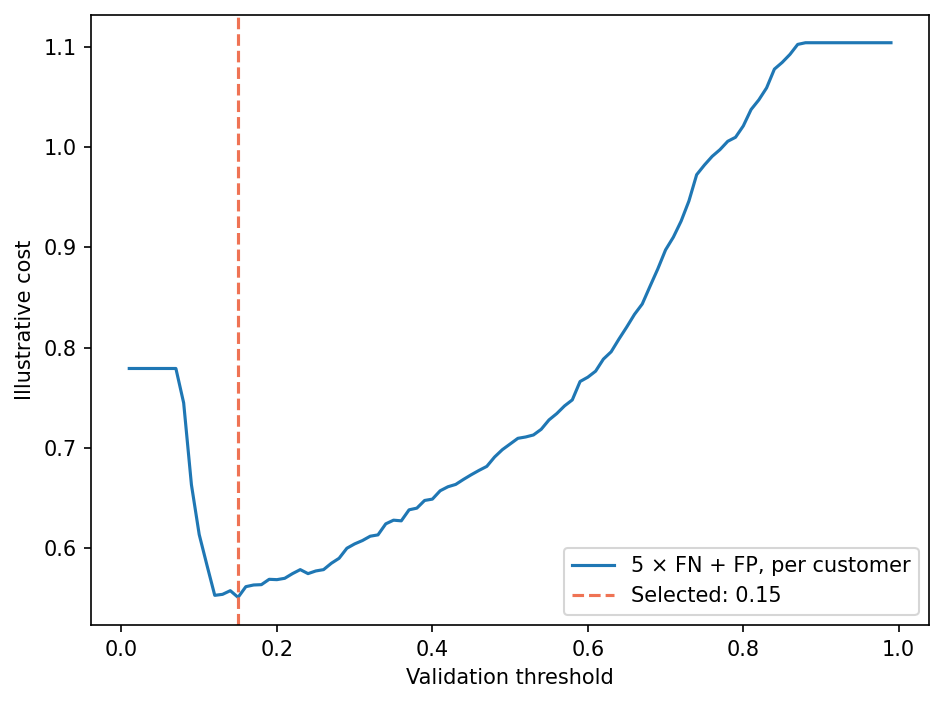
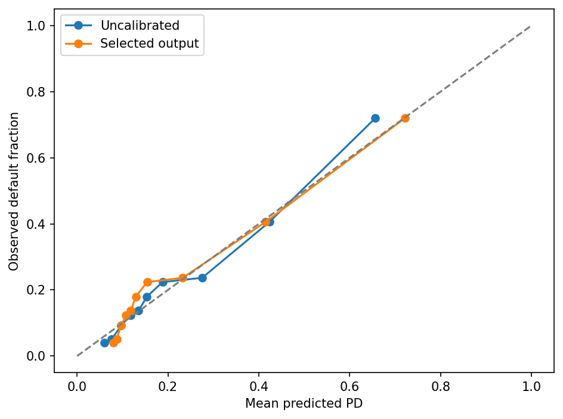
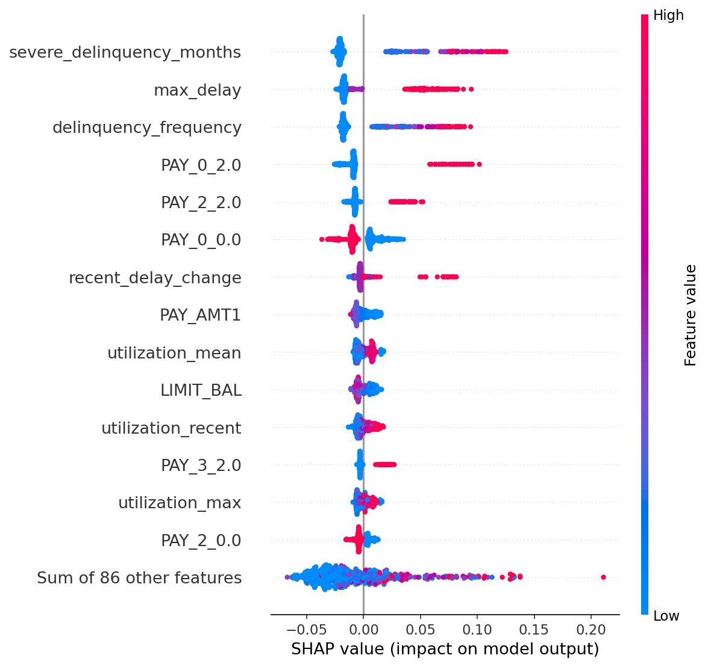
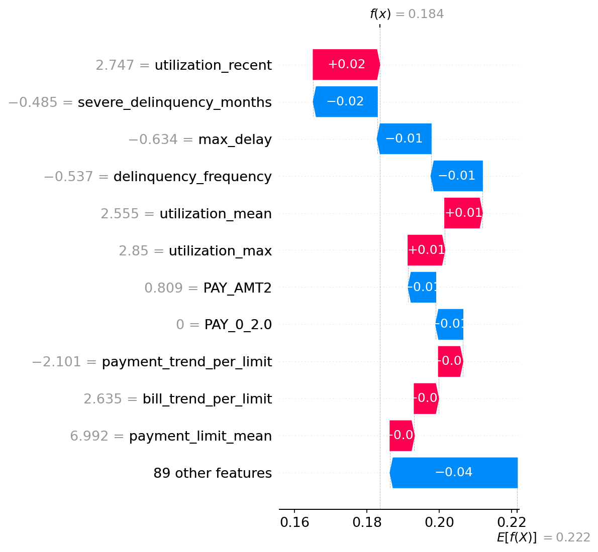

# Credit Risk Intelligence Platform
### Explainable ML for Default Risk Assessment

A reproducible ML repository that estimates next-month default probability from credit-card payment history, explains the underlying score and exposes a review-oriented demo through Streamlit and FastAPI.

**Educational decision support only. Not validated for automated lending, loan approval or use with current borrowers.**

Built around actual experiments on UCI's 30,000-client dataset, with grouped train/calibration/validation/test partitions, three model families, calibration, threshold cost analysis, SHAP and a demographic audit. The evaluated model is **Random Forest with sigmoid calibration**. See [verification evidence](reports/v2_verification_report.md) for executed checks and their limitations.

## Quick start

Use Python **3.12**. Raw data and fitted model binaries are intentionally excluded from Git. A fresh clone must acquire the dataset and train locally before launching either interface. Replace `<repository-url>` with this project's GitHub clone URL.

```bash
git clone <repository-url> credit-risk-intelligence
cd credit-risk-intelligence
python -m venv .venv
```

Activate the environment on your platform:

```powershell
# Windows PowerShell
.venv\Scripts\Activate.ps1
```

```bash
# macOS / Linux
source .venv/bin/activate
```

Install dependencies, acquire the UCI data and train:

```bash
python -m pip install -r requirements.txt
python -m src.data.acquire
python -m src.models.train
```

Training produces the local fitted artifact `models/credit_risk.joblib`, its SHA-256 checksum and experiment reports. It executes grouped tuning and calibration, so allow time for the experiment to finish. To check the resulting artifact before launching:

```bash
python -m pytest -q
python -m src.evaluation.verify
```

Launch Streamlit:

```bash
python -m streamlit run app/dashboard.py
```

In a second terminal, activate the same environment and launch FastAPI:

```bash
python -m uvicorn app.api:app --host 127.0.0.1 --port 8000
```

Dashboard: [localhost:8501](http://localhost:8501) · API docs: [127.0.0.1:8000/docs](http://127.0.0.1:8000/docs).

A trusted prebuilt model could be distributed separately as a future GitHub Release asset; this workflow assumes no release exists. Load only trusted joblib artifacts. Without a local fitted artifact, artifact integration tests are explicitly skipped. Application startup fails if neither a local artifact nor the pinned release is available, rather than serving placeholder predictions.

### Streamlit Community Cloud

Git does not store the fitted model binary. With `app/dashboard.py` as the entrypoint, shared inference startup retrieves the pinned [v2.0.0 release asset](https://github.com/Aahil0/credit-risk-intelligence/releases/download/v2.0.0/credit_risk.joblib) when `models/credit_risk.joblib` is absent; FastAPI uses the same path. The release must first be published with `credit_risk.joblib` attached. No release is assumed to exist yet, and a missing/invalid asset causes a clear startup failure without retraining or placeholder predictions.

Downloaded bytes must match SHA-256 `8426e02f00fb7d3dce1d9ea345986f1ec5093fda0bf83b8e01521ec5a1953180` before atomic installation, followed by the existing artifact checksum check. Existing local artifacts are used without downloading; local users can train as above or use the pinned release after it is published. Only the fixed project-owned URL and HTTPS redirects to GitHub release hosts are allowed. Checksums verify integrity, not code signing or publisher authenticity; joblib can execute code, so load only trusted artifacts.

## Problem context

Default detection is an imbalanced classification problem, but review prioritization also needs useful probabilities and interpretable explanations. This project focuses on **Probability of Default (PD)** and the tradeoff between missed defaults and unnecessary review flags. It does not estimate expected credit loss: exposure at default and loss given default are unavailable.

## Architecture



Both interfaces call the same inference service. Feature engineering and fitted preprocessing are serialized with the estimator; inference never rebuilds a scaler from applicant data. A SHA-256 check detects accidental artifact corruption. **A checksum is not an authenticity guarantee; joblib files execute Python during loading, so load only trusted files.**

## Dataset and provenance

- **Default of Credit Card Clients**, UCI Machine Learning Repository: [dataset page](https://archive.ics.uci.edu/dataset/350/default+of+credit+card+clients).
- 30,000 clients, 23 original explanatory variables; Taiwan, April–September 2005 historical records.
- Binary target: `default payment next month`, 1 = default, 0 = no default.
- Actual positives: **6,636 / 30,000 (22.12%)**.
- Monetary values are **New Taiwan dollars**. This is not an Indian/current lending dataset.
- Yeh, I. (2009). *Default of Credit Card Clients* [Dataset]. UCI Machine Learning Repository. [DOI: 10.24432/C55S3H](https://doi.org/10.24432/C55S3H).
- Dataset license: **CC BY 4.0**. Project code: **MIT**.

Original downloaded archive hash and validation facts are in `reports/data_validation.json`. No missing cells were found; signed negative bills are retained. ID is excluded. Sex, age, education and marriage are excluded from prediction and retained only for audit. Unknown demographic codes remain explicitly separate audit groups. Read [data/README.md](data/README.md) for detailed cleaning decisions.

## Historical feature engineering

19 financial inputs produce 15 additional historical features (34 columns before categorical expansion):

| Family | Features / construction | Interpretation and caveat |
|---|---|---|
| Utilization | Latest, mean and maximum bill / credit limit; months over limit | Statement-based utilization proxy, not complete credit exposure |
| Payment behavior | Latest/mean payment-to-bill ratio; zero-payment months; mean payment / limit | Positive bill denominators only; zero ratio plus nonpositive bill count otherwise; ratios capped at 10 |
| Delinquency | Count of positive repayment codes; count >=2; maximum positive delay; latest delay change | Undocumented −2/0 codes retained as categories; no invented meaning |
| Trends | Six-month chronological bill/payment slope divided by limit | Reverse September→April into chronological order before calculating slope |

Payment/bill ratios compare same-month observations; the source does not establish exact statement-settlement alignment. Interpret them as behavior proxies. Negative balances remain signed in utilization/trends. No target-derived features, ID features, test-derived quantiles or future-month observations are used.

The common pipeline engineers features, standardizes numeric columns and one-hot encodes repayment statuses with a fixed source-code domain −2…9. Scaling is essential for Logistic Regression; it is harmless for the tree models and keeps one shared preprocessing implementation. Missing/non-finite inputs are rejected rather than silently imputed, because this source has no missing values and the API requires complete histories.

## Split strategy and leakage controls

Identical **deployed financial inputs** are grouped, even when demographics or targets differ. There are 29,183 unique input groups and 817 repeated input rows. Ten shuffled, seeded stratified group folds allocate six folds to training, one to calibration, one to validation and two to test. Approximate proportions are 60/10/10/20; grouping makes exact counts slightly different.

| Partition | Clients | Default rate |
|---|---:|---:|
| Train | 17,998 | 22.12% |
| Calibration | 3,009 | 22.20% |
| Validation | 2,997 | 22.09% |
| Test | 5,996 | 22.10% |

- **Training:** three-fold grouped CV, with preprocessing fitted within each fold.
- **Calibration:** fit sigmoid/isotonic mappings on already fitted estimators via `FrozenEstimator`.
- **Validation:** compare model families by uncalibrated AP, select the chosen family's mapping by lowest Brier score, then select its threshold by illustrative cost. Log loss and reliability are separate diagnostics. The original experiment compared calibrated AP. A subsequent raw-AP audit of its validation evidence selects the same model; the fitted model and held-out predictions were retained.
- **Test:** evaluate only after these decisions are written to `reports/frozen_decisions.json`.

No SMOTE is used. Preserving source prevalence, evaluating precision–recall and adjusting the operating threshold is used in this experiment. Logistic Regression tuning includes both ordinary and balanced class weights. Random Forest and XGBoost use their natural-probability training objective, with cost sensitivity applied at threshold selection.

This is **within-cohort evaluation**, not an out-of-time backtest. Each client has six historical observations but one target; there are no multiple outcome months from which to construct temporal evaluation. Demographics are not used to define targets or thresholds.

## Models and tuning

| Model | Search |
|---|---|
| Logistic Regression | C ∈ {0.01, 0.1, 1}; class weight ∈ {none, balanced}; 2,500 max iterations |
| Random Forest | 160 trees; depth ∈ {8, 14}; minimum leaf size ∈ {10, 30} |
| XGBoost | 200 trees; learning rate 0.05; depth ∈ {2, 4}; min child weight ∈ {5, 15}; subsample/column sample 0.85 |

Fourteen parameter configurations × three folds = **42 CV fits**, plus final refits and calibration fits. Seed = 42; CPU histogram boosting; limited worker threads. The refit metric is **average precision**, not accuracy. ROC-AUC, PR-AUC/AP, precision, recall, F1, confusion counts, Brier and log loss are retained.

Best Random Forest: depth 8, leaf size 10, 160 trees, no class weighting. Raw validation AP is 0.5659, versus XGBoost 0.5619 and Logistic Regression 0.5526. XGBoost's raw validation ROC-AUC is higher (0.7871 versus 0.7828), but AP remains the primary discrimination criterion. Random Forest remains the selected model. The executed comparison is in `reports/v2_selection_audit.csv`.

Isotonic calibration is nondecreasing and can merge distinct scores into ties: XGBoost AP becomes 0.5449 and Random Forest isotonic AP becomes 0.5476. Calibrated ranking metrics remain diagnostic and no longer select the model family. Sigmoid preserves ranking here. Calibration still minimizes validation Brier, including the uncalibrated option; log loss and reliability curves are retained separately. XGBoost isotonic slightly improves Brier but worsens log loss, so no universal calibration improvement is claimed.

For Random Forest, validation Brier was 0.131998 without calibration, 0.131843 with sigmoid and 0.133182 with isotonic. **The improvement is small**; calibration was selected by this predefined criterion, not presented as a dramatic gain. Brier measures both calibration and resolution. Reliability plots provide a separate diagnostic.

## Executed test results

Held-out clients: **5,996**, including **1,325 defaults**. PR-AUC below means **average precision**, not trapezoidal area under the PR curve.

| Model | Calibration | ROC-AUC | AP | Precision | Recall | F1 | Brier ↓ | Threshold |
|---|---|---:|---:|---:|---:|---:|---:|---:|
| Logistic Regression | sigmoid | 0.7736 | 0.5513 | 0.6878 | 0.3525 | 0.4661 | 0.1353 | 0.50 |
| Random Forest | sigmoid | 0.7840 | 0.5672 | 0.4193 | 0.6702 | 0.5158 | 0.1344 | 0.15 |
| XGBoost | isotonic | 0.7823 | 0.5405 | 0.6589 | 0.3849 | 0.4859 | 0.1352 | 0.50 |

**Thresholds differ:** comparators are shown at 0.50; the selected model uses its validation-selected threshold. Use ROC/AP for ranking comparison. Do not attribute precision/recall differences solely to model choice.

Final confusion counts: **TN=3,441, FP=1,230, FN=437, TP=888**.

Frozen-prediction, 400-sample record-bootstrap 95% intervals: ROC-AUC **[0.7679, 0.7974]**, AP **[0.5411, 0.5959]**. These assume approximately IID records and exclude model-selection/retraining uncertainty; grouped/bootstrap temporal uncertainty is future work.




## Threshold and cost sensitivity

The main scenario assigns **cost 5 to a missed default and cost 1 to a false review flag**. This is an illustrative dimensionless assumption, not measured monetary loss. Validation thresholds 0.01…0.99 in steps of 0.01 are tested; minimum cost selects **0.15**. Ties prefer the higher threshold to reduce unnecessary flags. Neither costs nor threshold are optimized on test.

For the same frozen final model, moving from 0.50 to 0.15 changes test recall from **37.13% to 67.02%**, precision from **68.52% to 41.93%**, and illustrative cost/customer from **0.7323 to 0.5695**. This means more defaults detected **and more non-defaults flagged**. Flagging means demo review priority, never lending denial.

Separate cost ratios 1/2/5/10 are selected on validation and evaluated on test in `reports/cost_sensitivity.csv`. The ideal threshold for perfectly calibrated probabilities under uniform costs would be 1/(1+5) ≈ 0.167; validation grid selection gives 0.15 because calibration is imperfect and samples are finite. Threshold stability needs further study.




## Risk segments

| Segment | Frozen rule |
|---|---|
| LOW | PD < 0.09535463 (9.54%); validation PD 25th percentile |
| MEDIUM | 0.09535463063665424 ≤ PD < 0.21843748706391583 |
| HIGH | PD ≥ 0.21843748706391583 (21.84%); validation PD 75th percentile |

Boundaries are `numpy.quantile(validation_calibrated_PD, [0.25, 0.75], method="linear")`, using 2,997 validation records and no test scores or outcome labels. Equality enters the upper segment. LOW is below Q25, MEDIUM spans Q25 to below Q75, and HIGH starts at Q75. Ties can make counts differ from 25/50/25; collapsed quartiles fail explicitly. These are **relative descriptive segments**, not regulatory grades or safety guarantees. Independently, review flags use `PD >= 0.15` under assumed 5:1 costs. Some MEDIUM records are flagged; changing costs does not change the quartile rule.

| Test segment | Clients | Mean predicted PD | Observed default rate |
|---|---:|---:|---:|
| HIGH | 1,544 | 49.90% | 49.81% |
| LOW | 1,414 | 8.48% | 5.23% |
| MEDIUM | 3,038 | 12.96% | 15.87% |

Risk bands are ordered empirically, but segment probabilities are not perfectly calibrated: LOW overestimates observed defaults and MEDIUM underestimates them on this test cohort. Mean performance alone cannot establish individual calibration.

## Explainability

Global mean absolute SHAP and a beeswarm summary use 500 seeded held-out clients **after model selection**. An individual waterfall and interactive signed bar chart provide local explanations. Strongest global drivers are severe delinquency months, maximum delay and delinquency frequency.

**SHAP explains the underlying uncalibrated Random Forest probability.** Sigmoid calibration is a separate monotone mapping. Contributions sum with the base value to the raw probability; they do not sum to the displayed calibrated PD. Both increase/decrease drivers are exposed with readable labels, original monetary inputs in NT$ and unscaled historical derived values. Categorical indicators report the observed repayment code, indicator code and whether that indicator is active. `transformed_feature_value` remains available as a technical field and is not displayed as an applicant amount. For LR/XGBoost the analogous raw explanations use log-odds; the service documents this dynamically.

Correlated raw and engineered delinquency variables can share or redistribute credit. Tree-path-dependent SHAP uses the fitted tree structure rather than a causal feature-intervention model. Importance is model association, not advice that changing one feature will cause approval or eliminate risk. Global ranking is transformed-feature-level; categorical indicators are not combined into one raw-variable attribution.




## Application and API

The dashboard supports anonymized held-out demo profiles and edits to all six months of repayment status, bills and payments. It displays calibrated PD, bands, review flag, signed drivers, model evidence and the fairness audit. Inputs are not logged or saved. The dashboard runs the shared service locally; the independently available API exposes the same prediction path.

API arrays are **September → April**. Inputs are whole numbers in NT$. Credit limit > 0; repayment codes −2…9; payments ≥ 0; signed bills allowed. Arrays must contain exactly six values. Unexpected fields, including demographic variables, and invalid values return HTTP 422. Broad numeric guardrails prevent obviously extreme input; ranges outside training support trigger warnings rather than confidence claims.

```bash
curl http://127.0.0.1:8000/health
curl -X POST http://127.0.0.1:8000/predict -H "Content-Type: application/json" -d '{"credit_limit":200000,"repayment_status":[0,0,0,0,0,0],"bill_amounts":[45000,43000,40000,38000,35000,33000],"payment_amounts":[5000,5000,5000,5000,5000,5000]}'
```

For a shell-independent Python example:

```python
import requests
payload = {
    "credit_limit": 200000,
    "repayment_status": [0, 0, 0, 0, 0, 0],
    "bill_amounts": [45000, 43000, 40000, 38000, 35000, 33000],
    "payment_amounts": [5000, 5000, 5000, 5000, 5000, 5000],
}
response = requests.post("http://127.0.0.1:8000/predict", json=payload, timeout=10)
response.raise_for_status()
print(response.json())
```

A real executed request/response is saved in `reports/api_example_request.json` and `reports/api_example_response.json`. Responses include `probability_of_default`, `risk_category`, `flagged_for_review`, `important_risk_factors`, signed contributions, explanation units, review threshold and range warnings. Startup fails if the artifact is missing or its checksum is invalid; no placeholder scores are served.

## Reproduce and verify

Run commands from the repository root:

```bash
python -m src.data.acquire
python -m src.models.train
python -m src.evaluation.verify
python -m src.evaluation.smoke
python -m pytest -q
python -m compileall -q src app tests
python -m pip check
python notebooks/run_walkthrough.py
```

The notebook has actual captured outputs from in-process IPython execution. This runner avoids socket-based Jupyter kernels, which were unavailable in the build environment. It validates every executed code cell; notebook frontend rendering is a separate manual check. It is a walkthrough, not the source of the training implementation.

Training creates the local artifact and overwrites experiment reports, freezing choices before test evaluation. The committed reports describe the recorded experiment; preserve a copy before reproducing it if you want to compare runs. Use a new untouched evaluation cohort for substantive future selection changes. The README and model card describe the recorded fitted model. Update documentation and rerun notebook/verification after new experiments. Direct dependencies are pinned in `requirements.txt`; use `requirements-lock.txt` for the tested full dependency resolution on Python 3.12/Linux. Cross-platform wheels and numerical changes can affect results. Small metric differences across versions/hardware do not justify inventing results.

## Docker and CI

```bash
docker compose up --build
```

Dashboard: port 8501; API: port 8000. The image defaults to Streamlit, with Compose starting a separate API container from the same image. Both run as a non-root user. A fresh clone must acquire data and train locally before Docker build so the image includes the fitted artifact and checksum.

GitHub Actions defines lightweight contract/unit checks and a push-triggered full training/integration job with report upload. The latter needs UCI/package network access and may be slower. Without a model binary, local contract tests pass while artifact/dashboard tests are explicitly skipped; full CI training enables them. Docker is unavailable: its configuration was statically reviewed, but build/start are **not verified**. Hosted GitHub Actions has not run. V2 pinned dependencies, tests, API HTTP smoke and Streamlit AppTest/HTTP smoke were executed on Windows/Python 3.12.

## Repository layout

| Path | Responsibility |
|---|---|
| `app/dashboard.py`, `app/api.py`, `app/schemas.py` | Streamlit, FastAPI, strict request/response contracts |
| `src/data/acquire.py` | UCI acquisition, schema checks and provenance |
| `src/features/engineering.py`, `names.py` | Stateless historical features, fitted preprocessing, display labels |
| `src/models/train.py`, `explain.py`, `service.py` | Experiments, SHAP and shared trusted-artifact inference |
| `src/evaluation/metrics.py`, `verify.py` | Ranking/calibration/cost metrics and independent artifact checks |
| `notebooks/` | Executed experiment walkthrough and in-process runner |
| `tests/` | Feature, boundary, API, leakage, checksum, metric, SHAP and dashboard tests |
| `models/` | Compressed fitted pipeline, calibration, background, metadata and checksum |
| `reports/figures/` | Actual EDA, evaluation and SHAP plots |
| `reports/` | CV tables, splits, predictions, audits, cost sensitivity, verification summaries and model card |
| `data/README.md`, `data/raw/` | Attribution and original archive (raw data ignored by git) |
| `.github/workflows/ci.yml` | Unit/contract checks and trained integration workflow |
| `Dockerfile`, `docker-compose.yml` | Local two-service container definition |

## Fairness, ethics and limitations

- Excluding sex/age/education/marriage reduces direct demographic use but **does not prove fairness**. Financial history can act as a proxy and reflect unequal historical access.
- `reports/fairness_audit.csv` reports group size, prevalence, flag rate, TPR, FPR and Brier. TPR/FPR is suppressed when the relevant denominator is <30; groups <100 are marked small. For groups with n ≥ 100, Wilson 95% intervals accompany prevalence, flag rate, TPR and FPR (relevant denominators ≥ 30). Brier, mean predicted PD and calibration gap are point estimates. Intervals use an independent-record approximation, exclude clustering/model-selection uncertainty and multiple-comparison adjustment, and are not fairness certification. Intersectional analysis remains absent.
- Recorded demographics have narrow binary/legacy coding; undocumented education/marriage groups are not silently relabeled as known groups. The audit cannot establish outcomes for unrecorded identities.
- Historical default labels may reflect structural inequities. No regulatory compliance, lending eligibility, fairness certification or causal claim is made.
- No temporal or external geographic validation, policy optimization, reject-inference correction, economic stress testing, EAD/LGD, applicant consent workflow or model monitoring is implemented.
- No guarantee of calibrated PD for individuals, new applicants, current populations or out-of-distribution inputs. Training-range warnings are a limited check, not a full drift detector.
- Public deployment needs authentication, rate limiting, transport security, privacy review and access controls. Local demo inputs are not persisted.

## Recommended next work

1. Validate on a fresh temporal/external cohort before any claim beyond this historical sample.
2. Add grouped bootstrap intervals for error/calibration measures and intersectional audits; current rate intervals use an independent-record approximation.
3. Compare calibration/ranking strategies and threshold stability with nested selection or repeated grouped splits; reserve fresh test data.
4. Run feature ablations to quantify engineered features' contribution and reduce redundant delinquency features.
5. Add batch scoring, schema-versioned artifact releases and monitoring using an appropriate new dataset.

**Verification evidence:** [reports/v2_verification_report.md](reports/v2_verification_report.md) · [model card](reports/model_card.md). Figures are generated from executed experiments, not dashboard screenshots.

## Reproducibility and verification evidence

The fitted model, calibration and review threshold were retained after auditing raw validation AP. Descriptive segment metadata was updated from validation scores, with every one of the 5,996 stored held-out probabilities unchanged. Artifact metadata records the predecessor checksum; the current checksum accompanies the fitted artifact. This is a retrospective audit of a known historical holdout, not a new blinded test.

Executed checks and limitations are recorded in [the verification report](reports/v2_verification_report.md). Public experiment tables, figures and concise verification outputs are described in [reports/README.md](reports/README.md); transient local logs are excluded from Git. Full dependency resolutions are available in `requirements-lock-windows.txt` and the existing Linux `requirements-lock.txt`.

Reproducing training overwrites local evidence and does not create a fresh test cohort. Substantive new model selection requires new untouched evaluation data. The notebook contains executed outputs from the retained fitted model and recorded experiment.
